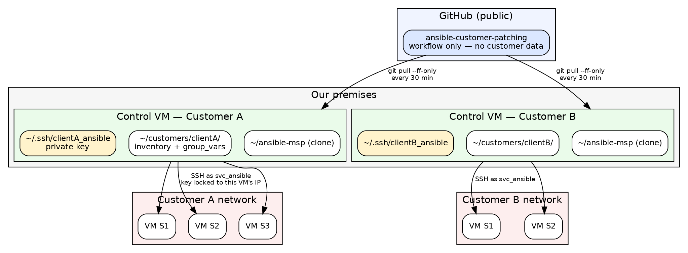
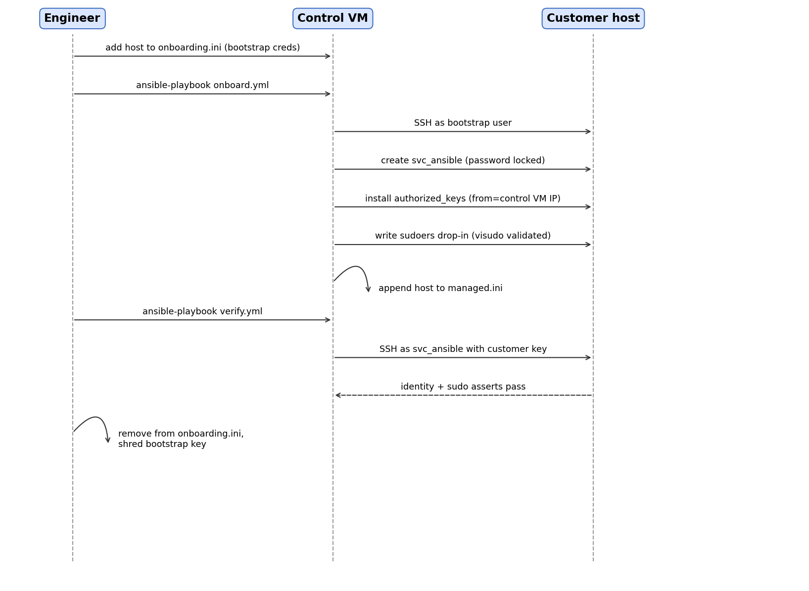

# Ansible Customer Patching

Onboards customer Linux VMs into managed patching and keeps them patched.
One control VM per customer, on our premises, holding that customer's SSH key,
network config, and inventory.

Repo: https://gitlab.com/riyanalhumaidhi/ansible-msp

---

## What it does

Turns whatever credential a customer gives you (root password, cloud key, .pem)
into a standard, isolated management identity:

- `svc_ansible` account, password-locked, key-only
- key restricted to the control VM's IP (`from=`), so a leaked key is useless elsewhere
- sudo via a `visudo`-validated drop-in
- host recorded in that customer's managed inventory

Then assess/patch run against that identity.

## Architecture



- **Public repo** — playbooks only, no customer data. Control VMs auto-pull `main` every 30 min.
- **Control VM** — one per customer. Holds the only copy of that customer's key and inventory.
- **Customer hosts** — reachable over SSH (VPN/bastion configured on the control VM, not here).


A host is in `onboarding.ini` or `managed.ini`, never both. `onboard.yml` moves it.

## Requirements

- Control VM: Debian/Ubuntu or RHEL-family. Ansible + git (installed by `setup.sh`).
- Customer hosts: Debian- or RedHat-family Linux with Python and SSH.
- No Ansible collections needed — `ansible.builtin` only.

---

## Setup

Two helper scripts cover the common paths. Both are idempotent and never
overwrite an existing key or `all.yml`.

### New control VM

Configure the customer's VPN/bastion first, then as a **non-root** user:

```bash
git clone https://gitlab.com/riyanalhumaidhi/ansible-msp ~/ansible-msp
~/ansible-msp/control/setup.sh clientB https://gitlab.com/riyanalhumaidhi/ansible-msp
```

Installs `ansible`, `git` and `sshpass` (needed only for password-based
onboarding — on RHEL it lives in EPEL, so the script warns rather than fails if
it's unavailable), clones the repo, and enables the 30-min auto-pull timer.

`setup.sh` prepares the **machine**; `new-customer.sh` below adds the
**customer**. They no longer overlap.

### New customer

```bash
cd ~/ansible-msp
./new-customer.sh clientb "Client B" 192.168.1.13
```

Generates the ed25519 key pair, creates `~/customers/clientb/` with
`group_vars/all.yml` (public key and settings already filled in), `managed.ini`
and `onboarding.ini`, then prints the offboard token.

`<slug>` must be lowercase/dashes — it names the folder, the key, and the
offboard confirmation token.

> ⚠️ The third argument is `control_node_ips` — the IP the **host sees**, not what
> you think this VM's address is. Confirm with `ssh <host> 'echo $SSH_CLIENT'`
> (first field). Omit it and the script writes `CHANGE_ME` and warns. A wrong
> value locks this VM out of every host at once.

**Customer data lives in `~/customers/`, outside the clone** — this repo is
public and a `git pull` must never touch it. Override the location with
`MSP_DATA_ROOT` if you keep it elsewhere.

### New host

```bash
./add-host.sh clientb 192.168.1.50 root ~/.ssh/their-bootstrap-key.pem
ansible-playbook -i ~/customers/clientb/managed.ini playbooks/verify.yml
shred -u ~/.ssh/their-bootstrap-key.pem
```

Arguments: `<customer> <host> [login_user] [bootstrap_key]`. The script fixes the
key's permissions, passes the host inline (so **no inventory file is edited**),
and appends it to `managed.ini` on success. Add `-- --check --diff` for a dry run.

**If the customer gave you a password instead of a key**, omit the 4th argument
and you'll be prompted:

```bash
./add-host.sh clientb 192.168.1.50 root          # prompts for SSH password
```

This needs **sshpass** on the control VM (`apt install sshpass` /
`dnf install sshpass`, EPEL on RHEL) — Ansible shells out to it for password
auth. Without it the script stops with a clear message instead of the misleading
`Failed to connect to the host via ssh` you'd otherwise get. Append
`-- --ask-become-pass` if that account also needs a password for sudo.

Doing it by hand instead — add the host under `[new_hosts]` in
`~/customers/clientb/onboarding.ini` with its own `ansible_user`,
`ansible_ssh_private_key_file` and `ansible_ssh_common_args='-o IdentitiesOnly=yes'`,
then run `playbooks/onboard.yml` against that inventory.



### Routine

```bash
ansible-playbook -i ~/customers/clientb/managed.ini playbooks/assess.yml   # daily, read-only
ansible-playbook -i ~/customers/clientb/managed.ini playbooks/patch.yml    # maintenance window
```

---

## Playbooks

| Playbook | Inventory | Does | Safe to re-run |
|---|---|---|---|
| `onboard.yml` | onboarding.ini | creates account, key, sudo; promotes host to managed.ini | yes |
| `verify.yml` | managed.ini | proves SSH + sudo work as `svc_ansible` | yes, read-only |
| `assess.yml` | managed.ini | reports pending updates + reboot needed, writes JSON | yes, read-only |
| `patch.yml` | managed.ini | applies updates, batched, optional reboot | yes |
| `offboard.yml` | managed.ini | **removes** our access — account, key, sudo | yes |

All are idempotent — a second run reports `changed=0`.

### assess.yml output

Besides the on-screen summary, each run writes one JSON file per host to
`~/assess-reports/` **on the control VM** (nothing is written to the target):

```json
{
  "customer": "Client A",
  "host": "10.0.0.5",
  "os": "Ubuntu 22.04",
  "os_family": "Debian",
  "reboot_required": false,
  "timestamp": "2026-07-29T10:58:18Z",
  "updates_pending": 7
}
```

Filename: `<customer-slug>_<host>_<date>.json`. Ansible keeps no state between
runs — collect these to an admin node and they become your patch-compliance
history. Change the location with `-e report_dir=/path`.

### patch.yml safety

Two controls bound the damage a bad update can do:

- **`serial`** (default 50%) — how many hosts are patched at once.
- **`max_fail_percentage`** (default **0**) — if more than this share of a batch
  fails, the play stops and **later batches never run**.

Together: a broken update reaches one batch, then halts. Relax with
`-e max_fail=20` when some failures are expected.

`patch.yml` **never reboots unless told to** (`-e reboot_if_required=true`), and
on Debian runs `autoremove`/`autoclean` *before* upgrading so a full `/boot`
doesn't fail the kernel install.

### offboard.yml

Destructive and irreversible — run it **last**, after anything else you need
from those hosts. It requires a confirmation matching the customer:

```bash
ansible-playbook -i ~/customers/clientB/managed.ini playbooks/offboard.yml \
  -e confirm_offboard=client-b
```

The token is the slugified `customer_name` (lowercase, non-alphanumerics → `-`).
A plain `-e confirm_offboard="Client B"` will **not** work — Ansible splits
`key=value` on whitespace. The refusal message prints the exact token to use.

## Variables

**`~/customers/<name>/group_vars/all.yml`** — applies to both inventories:

| Variable | Default | Notes |
|---|---|---|
| `customer_name` | — | required |
| `mgmt_user` | — | service account name, e.g. `svc_ansible` |
| `mgmt_authorized_keys` | — | list of public keys. Removing one removes it from every host next run. |
| `control_node_ips` | — | the `from=` restriction. Must match what hosts see. |
| `mgmt_sudo_nopasswd` | `true` | `false` → sudo needs a password (`--ask-become-pass`) |
| `ansible_user` | — | set to `"{{ mgmt_user }}"` |
| `ansible_ssh_private_key_file` | — | this customer's key. Wrong path = publickey rejected. |
| `ansible_ssh_common_args` | — | e.g. `-o ProxyJump=user@bastion.customer.com` |

**Run-time (`-e`):**

| Variable | Playbook | Default | Effect |
|---|---|---|---|
| `reboot_if_required` | patch | `false` | reboot hosts that need it |
| `update_batch` | patch | `50%` | `1` = one host at a time |
| `max_fail` | patch | `0` | % of a batch allowed to fail before the play halts |
| `security_only` | patch | `false` | RHEL only; ignored on Debian |
| `expected_mgmt_user` | verify | `mgmt_user` | identity assertion override |
| `report_dir` | assess | `~/assess-reports` | where JSON reports are written (control VM) |
| `confirm_offboard` | offboard | — | **required**; slugified `customer_name` |

## Verifying it worked

On the host after onboarding:

```bash
id svc_ansible
sudo cat /home/svc_ansible/.ssh/authorized_keys    # from="<IP>",... ssh-ed25519 ...
sudo visudo -c
```

`verify.yml` should report `ok=5 changed=0` and `svc_ansible -> root OK`.

Auto-pull on the control VM: `systemctl --user list-timers repo-sync.timer`

---

## Troubleshooting

Diagnostic order: **host auth log → `authorized_keys` → key the client offers.**

```bash
sudo journalctl -u ssh -S -30min | grep svc_ansible   # Ubuntu/Debian
sudo grep svc_ansible /var/log/secure | tail          # RHEL
```

| Symptom | Cause | Fix |
|---|---|---|
| `Connection closed ... [preauth]` | `from=` rejects the source IP | log shows the real IP — put it in `control_node_ips`, re-run onboard |
| `Permission denied (publickey)` | wrong/missing `ansible_user` or key path in `all.yml`; or host rebuilt | check `all.yml`; `ssh-keygen -y -f <key>` must match `authorized_keys` |
| `Too many authentication failures` | agent offering other customers' keys | add `-o IdentitiesOnly=yes` per host in `onboarding.ini` (never globally) |
| `UNPROTECTED PRIVATE KEY FILE` | key is 0644 | `chmod 600` |
| `Host key verification failed` | ran outside `~/ansible-msp` so `ansible.cfg` didn't load | run from the repo root |
| `Missing: customer_name, ...` | `group_vars/all.yml` not loaded | file must be `all.yml` (not `.example.yml`) next to the inventory |
| `Unable to parse ... inventory source` | file missing or unreadable | check the path in the warning |
| `git pull --ff-only` fails | control VM drifted or history rewritten | `git fetch origin && git reset --hard origin/main` |
| `/boot` full on Debian patch | old kernels | `apt-get autoremove --purge`, re-run |

---

## Operating notes

- **Back up `~/customers/` and `~/.ssh/*_ansible*`** on every control VM. Only copies.
- **Every push to `main` is live everywhere in 30 min.** No staging branch — test with
  `--check --diff` first.
- **Never edit repo files on a control VM.** Workflow changes go through git;
  drift = reset the clone. `~/customers/` is data, not code — edit it freely.
- **Schedule `verify.yml` daily** — catches rebuilt hosts and broken `from=` restrictions.
- **Key rotation:** add new key to `mgmt_authorized_keys` → onboard → switch
  `ansible_ssh_private_key_file` → verify → remove old key → onboard again.
- **Control VM IP change:** add the new IP to `control_node_ips` and re-run onboard
  **before** decommissioning the old address.
- Repo is public and control VMs run it as root: protect `main`, require 2FA,
  read every external PR.

## Not covered

Windows hosts; patch-compliance history or CVE reporting (Ansible is stateless —
see the results-collector idea if you need dashboards); Linux major-version upgrades.
